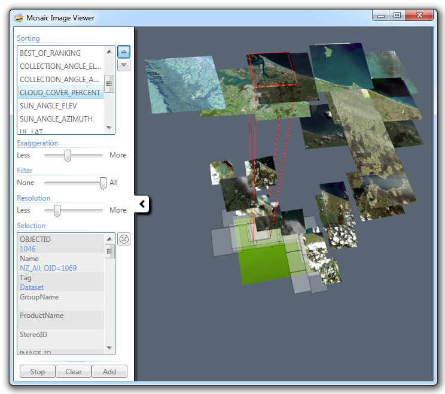
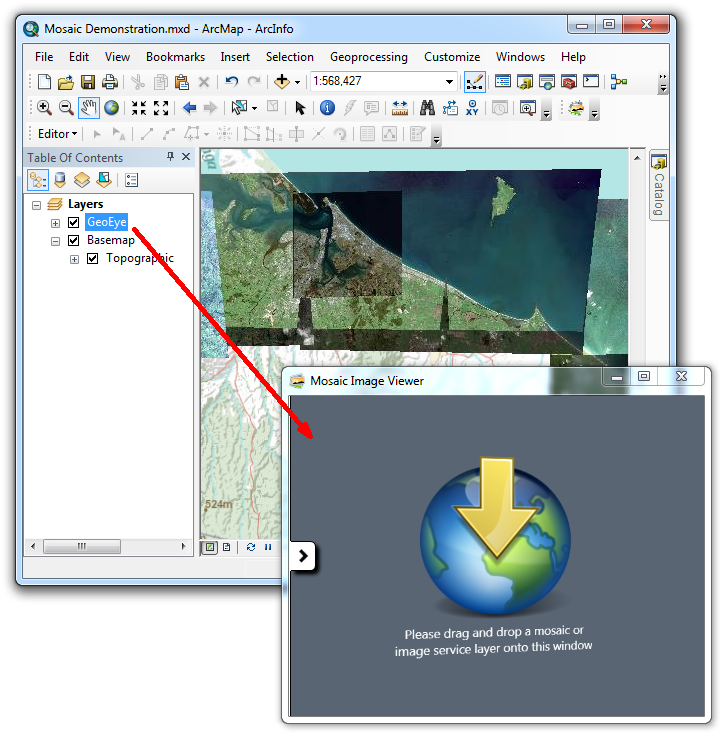
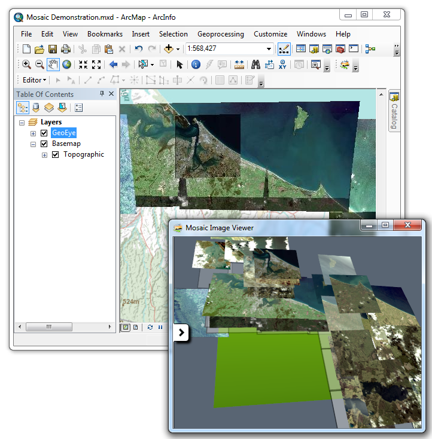

# Mosaic Image Selector

Mosaic Image Selector is an add-in for [Esri](http://www.esri.com/)'s [ArcMap](http://www.esri.com/software/arcgis) to explore imagery within a [mosaic](http://www.esri.com/news/arcuser/0610/mosaicdataset.html) dataset or image service. The [add-in](http://blogs.esri.com/esri/arcgis/2010/05/05/add-ins-for-arcgis-desktop-10/) supports mosaics stored locally in a geodatabase (or SDE connection) and mosaics published to ArcGIS Server as [image services](http://www.esri.com/software/arcgis/arcgisserver/extensions/image-extension).

When a mosaic layer is dropped on to the Mosaic Image Finder window, thumbnails of mosaic images that overlap the current map extent are displayed in the three dimensional viewer as shown above. These images can be sorted vertically based on any existing numeric field.

The aim of this add-in was to provide an intuitive user interface for sorting and searching imagery in a mosaic. This add-in is particularly useful when mosaics contain good attribution and images are plentiful within an area of interest. When an image is selected, as indicated above with a red outline, it can be added to ArcMap as a new layer.

This repository does not include the compiled [add-in](http://resources.arcgis.com/en/help/main/10.1/index.html#//014p0000001m000000). The source must be downloaded and build using Microsoft [Visual Studio](https://www.visualstudio.com/) on a computer with ArcGIS Destkop 10.3+.

The Mosaic Image Finder window is created using [WPF 3D](https://msdn.microsoft.com/en-us/library/ms747437%28v=vs.110%29.aspx) (.NET). One of the difficulties when developing this application was creating a threading model for background image requests. If images were downloaded in the UI thread then ArcMap would totally lock-up. Even though background threads can use ArcObjects, it is not recommended to parse ArcObject references between threads, doing so will cause cross-thread issues such as a severe performance hit.  When possible I created proxy classes to assist with the exchange of simple data types like [IEnvelope](http://resources.arcgis.com/en/help/arcobjects-net/componenthelp/index.html#//002m00000169000000). However to parse a [Layer](http://resources.arcgis.com/en/help/arcobjects-net/componenthelp/index.html#//0012000006z1000000) I was forced to persist the layer to file and have it opened in the background thread, not the best but unavoidable.
